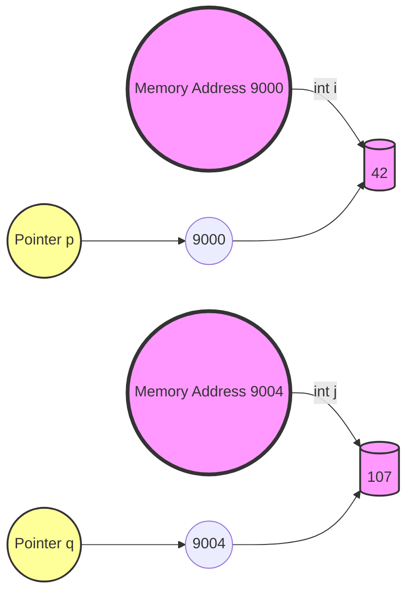
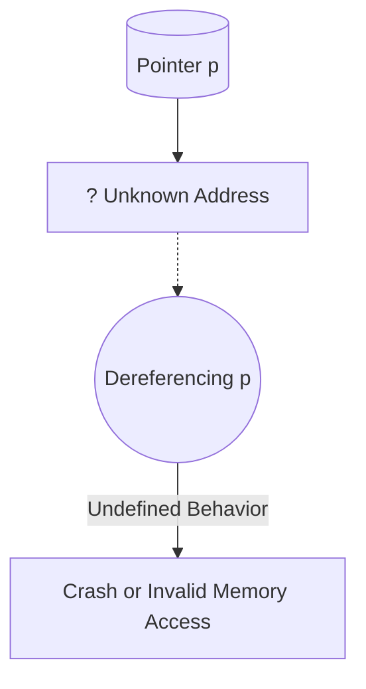

For this transcript, we can structure the book section as follows:

### Section 3: Introduction to Pointers in C

#### 3.1 Overview of Pointers
- Introduction to what pointers are and their significance in C programming.
- Basic operations: declaring pointers, assigning memory addresses, and dereferencing.

#### 3.2 Motivation for Using Pointers
- Why pointers are integral to C programming, including sharing memory, managing dynamic data structures, and dealing with function arguments.
- Use cases: linked lists, binary trees, graphs, and passing data by reference.

#### 3.3 Memory Allocation and Addressing
- The concept of memory and how it is represented (with examples of memory addresses).
- How integers and pointers are stored in memory (including memory representation).
  
#### 3.4 Pointer Operations in Detail
- Using pointers: examples with code snippets.
- Visualizing memory with diagrams and understanding how memory addresses relate to pointers.
  
##### Example Code: Declaring and Using Pointers
```c
int i = 42;
int *p = &i;
printf("Value of i: %d", *p); // Output: 42
```

#### 3.5 Common Pitfalls with Pointers
- Potential errors, including assigning addresses incorrectly and using uninitialized pointers.
- Explanation of segmentation faults and accessing invalid memory.

#### 3.6 Pointer Arithmetic
- Introduction to pointer arithmetic, including how pointers can traverse arrays.
- Explanation of how adding to a pointer skips a number of bytes depending on the type.

##### Example Code: Pointer Arithmetic
```c
int array[4] = {2, 4, 6, 8};
int *p = array;
printf("%d", *(p + 2)); // Output: 6
```

#### 3.7 Arrays and Pointer Relationships
- How arrays and pointers are closely related in C.
- Explanation of array indexing as a form of pointer arithmetic.

#### 3.8 Dynamic Memory Allocation
- Explanation of `malloc`, `sizeof`, and `free`.
- Memory allocation on the heap vs. the stack.
- Importance of freeing memory to prevent memory leaks.

##### Example Code: Dynamic Memory Allocation
```c
int *p = (int *)malloc(sizeof(int));
*p = 17;
printf("Value: %d", *p); // Output: 17
free(p);
```

#### 3.9 Exercises
1. **Exercise 1: Basic Pointer Operations**
   - Declare a pointer and assign it to an integer variable. Print the value using the pointer.

2. **Exercise 2: Pointer Arithmetic**
   - Use a pointer to traverse an array and print each value.

#### 3.10 Solutions
The solutions to exercises can be found in Appendix A.

#### Visual Aids:
- **Diagram 1**: Illustration of memory addresses and how variables are stored in memory.
- **Diagram 2**: Example of pointer arithmetic showing how the pointer moves through memory.


### 1. **What is the difference between memory allocation on the stack and the heap in C?**

In C, memory can be allocated on both the stack and the heap, but they differ significantly in how memory is managed.

- **Stack Memory**: Memory on the stack is automatically allocated when a function is called, and it's deallocated when the function exits. The stack is structured in a last-in, first-out (LIFO) manner, meaning variables in a function are discarded once the function call ends. Stack memory is limited, but it is very fast and ideal for variables with a short lifespan. However, because the stack is managed by the system, you don't have to explicitly allocate or free the memory.
  
- **Heap Memory**: Memory on the heap, on the other hand, is manually allocated and deallocated by the programmer using functions like `malloc` and `free`. Heap memory is generally used for data that needs to persist beyond a single function call or for large data structures like linked lists and trees. However, heap allocation is slower compared to stack allocation, and improper management (such as not freeing memory) can lead to memory leaks.

**Advantages & Trade-offs**:
- Stack memory is faster but limited in size, and it is automatically managed.
- Heap memory is larger and can persist across function calls, but it requires explicit management, including freeing memory when no longer needed, which can be error-prone.

### 2. **How does pointer arithmetic handle different data types, such as int, char, and double, and what happens when you perform arithmetic on a pointer that points to each of these types?**

Pointer arithmetic adjusts based on the size of the data type to which the pointer points. When you increment or decrement a pointer, C automatically accounts for the size of the type the pointer references.

- **For `int` pointers**: Since an `int` typically occupies 4 bytes in memory, when you increment an `int` pointer (e.g., `p + 1`), the pointer moves 4 bytes forward in memory.
- **For `char` pointers**: A `char` is 1 byte, so incrementing a `char` pointer moves the pointer by 1 byte.
- **For `double` pointers**: A `double` typically takes up 8 bytes, so adding 1 to a `double` pointer moves it 8 bytes forward.

Pointer arithmetic is essential for navigating arrays because when you perform arithmetic on a pointer, C skips ahead in memory by the size of the data type. This means understanding the size of the data type is crucial to avoid reading or writing to unintended memory areas.

Example:
```c
int array[4] = {2, 4, 6, 8};
int *p = array;
printf("%d", *(p + 2)); // Accesses array[2] and prints 6
```

### 3. **Why is it dangerous to use a pointer after it has been freed, and how can this lead to memory corruption or program crashes?**

Using a pointer after it has been freed leads to what's known as a **dangling pointer**. Once memory is freed, it becomes available for other parts of the program, but the pointer still holds the address of that memory. If you dereference or use that pointer, you may be accessing or modifying memory that has already been reallocated for another use, leading to **memory corruption**.

For example, if memory is freed but the pointer is used to store new data, it may overwrite data that another part of the program is using, causing unpredictable behavior or crashes (e.g., segmentation faults).

To prevent this, after freeing memory, it’s good practice to set the pointer to `NULL`, which ensures the pointer doesn’t refer to any memory location.

Example of a dangling pointer:
```c
int *p = (int *)malloc(sizeof(int));
*p = 42;
free(p);
printf("%d", *p); // Dangerous, memory has been freed
```

### 4. **How do arrays and pointers in C relate to each other, and in what ways can we use pointer syntax to manipulate arrays?**

Arrays and pointers in C are closely related. An array name is essentially a constant pointer to the first element of the array. Therefore, you can use pointers to traverse and manipulate arrays in C.

For example, array indexing (`arr[i]`) is equivalent to using pointer arithmetic (`*(arr + i)`):
```c
int arr[4] = {2, 4, 6, 8};
int *p = arr;
printf("%d", *(p + 2)); // Same as printf("%d", arr[2]);
```

This equivalence gives you flexibility in how you handle arrays, but it also requires caution. If you mistakenly use pointer arithmetic to access memory outside the array bounds, it can lead to segmentation faults or unexpected behavior.

Arrays and pointers are often interchangeable in C, but with one key difference: arrays have a fixed size, while pointers can point to different memory locations and can be resized dynamically using memory allocation functions.

### 5. **What are some common pitfalls when dealing with uninitialized pointers, and how can tools like Valgrind help detect and debug pointer-related errors in C?**

One common pitfall in C programming is using **uninitialized pointers**. These pointers don’t point to a valid memory location and contain garbage values, leading to undefined behavior when dereferenced. Dereferencing such a pointer can cause a segmentation fault, as the memory being accessed may not be allocated or may belong to another process.

Another common pitfall is **memory leaks**, where dynamically allocated memory is not freed. This can happen if a pointer to the memory is lost before the memory is freed, making it impossible to reclaim that memory.

**Tools like Valgrind** can help detect these errors:
- **Uninitialized pointer use**: Valgrind can report when a pointer is used without being properly initialized, helping to track down the root cause of crashes or unexpected behavior.
- **Memory leaks**: Valgrind can also detect memory that has been allocated but never freed, providing a summary of leaks at the end of program execution.

By using Valgrind and other debugging tools, you can more easily find and fix issues related to pointer management, ensuring your program uses memory safely and efficiently.

Example of uninitialized pointer error:
```c
int *p;
*p = 10; // Undefined behavior, p points to an uninitialized location
```

By using tools like Valgrind, you can catch errors like this before they cause major problems in your program.

Here are some more complex coding examples that illustrate the key concepts discussed in the transcript, including pointers, pointer arithmetic, memory allocation, arrays, and managing memory in C.

### 1. **Dynamic Memory Allocation and Freeing**

This example demonstrates how memory is dynamically allocated on the heap using `malloc`, how to use pointer arithmetic to manipulate memory, and how important it is to free memory to avoid leaks.

```c
#include <stdio.h>
#include <stdlib.h>

int main() {
    // Dynamically allocate memory for an array of 5 integers
    int *arr = (int *)malloc(5 * sizeof(int));
    
    // Check if memory allocation was successful
    if (arr == NULL) {
        printf("Memory allocation failed!\n");
        return 1;
    }

    // Initialize array using pointer arithmetic
    for (int i = 0; i < 5; i++) {
        *(arr + i) = i * 10;  // Equivalent to arr[i] = i * 10;
    }

    // Print array elements using pointer arithmetic
    printf("Array elements:\n");
    for (int i = 0; i < 5; i++) {
        printf("%d ", *(arr + i));  // Equivalent to printf("%d ", arr[i]);
    }
    printf("\n");

    // Free the dynamically allocated memory
    free(arr);

    // Dangerous! Accessing memory after it is freed
    // Uncommenting the below line will cause undefined behavior (segmentation fault)
    // printf("After free: %d\n", arr[0]);

    return 0;
}
```

**Key points illustrated:**
- Dynamically allocating memory for an array of integers using `malloc`.
- Using pointer arithmetic to initialize and access elements in the array.
- Freeing the allocated memory and explaining the risks of accessing freed memory.

### 2. **Pointer Arithmetic with Different Data Types**

This example shows how pointer arithmetic behaves differently for `int`, `char`, and `double` data types due to their size differences in memory.

```c
#include <stdio.h>

int main() {
    int intArray[3] = {10, 20, 30};
    char charArray[3] = {'a', 'b', 'c'};
    double doubleArray[3] = {1.1, 2.2, 3.3};

    int *intPtr = intArray;
    char *charPtr = charArray;
    double *doublePtr = doubleArray;

    // Pointer arithmetic with int
    printf("Pointer arithmetic with int:\n");
    printf("intPtr = %p, intPtr + 1 = %p\n", (void *)intPtr, (void *)(intPtr + 1));
    
    // Pointer arithmetic with char
    printf("Pointer arithmetic with char:\n");
    printf("charPtr = %p, charPtr + 1 = %p\n", (void *)charPtr, (void *)(charPtr + 1));
    
    // Pointer arithmetic with double
    printf("Pointer arithmetic with double:\n");
    printf("doublePtr = %p, doublePtr + 1 = %p\n", (void *)doublePtr, (void *)(doublePtr + 1));

    return 0;
}
```

**Key points illustrated:**
- Pointer arithmetic for different data types (`int`, `char`, and `double`).
- The output shows that pointer increments are based on the size of the data type:
  - `int` increments by 4 bytes.
  - `char` increments by 1 byte.
  - `double` increments by 8 bytes.

### 3. **Dangling Pointer Example**

This example demonstrates the dangers of using a pointer after freeing the allocated memory, also known as a dangling pointer, which leads to undefined behavior.

```c
#include <stdio.h>
#include <stdlib.h>

int main() {
    // Dynamically allocate memory for an integer
    int *p = (int *)malloc(sizeof(int));

    // Check if memory allocation was successful
    if (p == NULL) {
        printf("Memory allocation failed!\n");
        return 1;
    }

    *p = 42;  // Assign value to the allocated memory
    printf("Value before free: %d\n", *p);

    // Free the memory
    free(p);

    // After freeing, the pointer is now dangling
    // Dereferencing it will cause undefined behavior (possible crash)
    // Uncommenting the below line may cause a segmentation fault
    // printf("Value after free: %d\n", *p);

    // To prevent this, we can set the pointer to NULL
    p = NULL;

    return 0;
}
```

**Key points illustrated:**
- Allocating and freeing memory for an integer.
- Illustrating how dereferencing a dangling pointer (after calling `free`) can lead to undefined behavior.
- Showing good practice by setting the pointer to `NULL` after freeing it.

### 4. **Arrays and Pointers: Interchangeability and Risks**

This example shows how arrays and pointers are closely related in C and how array indexing is equivalent to pointer arithmetic.

```c
#include <stdio.h>

int main() {
    int arr[5] = {1, 2, 3, 4, 5};
    int *ptr = arr;  // Pointer to the first element of the array

    // Access array elements using array indexing
    printf("Using array indexing:\n");
    for (int i = 0; i < 5; i++) {
        printf("arr[%d] = %d\n", i, arr[i]);
    }

    // Access array elements using pointer arithmetic
    printf("Using pointer arithmetic:\n");
    for (int i = 0; i < 5; i++) {
        printf("*(ptr + %d) = %d\n", i, *(ptr + i));
    }

    // Go out of bounds using pointer arithmetic (dangerous)
    // Uncommenting the below line will cause undefined behavior
    // printf("Out of bounds: %d\n", *(ptr + 10));

    return 0;
}
```

**Key points illustrated:**
- Demonstrating the equivalence of array indexing (`arr[i]`) and pointer arithmetic (`*(ptr + i)`).
- Showing the risks of accessing memory out of bounds using pointer arithmetic.

### 5. **Common Pitfalls: Uninitialized Pointer**

This example demonstrates how using an uninitialized pointer can lead to a segmentation fault or undefined behavior.

```c
#include <stdio.h>

int main() {
    int *p;  // Uninitialized pointer (does not point to valid memory)

    // Dereferencing an uninitialized pointer (dangerous)
    // Uncommenting the below line will likely cause a segmentation fault
    // printf("Value of uninitialized pointer: %d\n", *p);

    // Correct way: Allocate memory or assign it to a valid address
    int x = 10;
    p = &x;
    printf("Value after initialization: %d\n", *p);

    return 0;
}
```

**Key points illustrated:**
- Illustrating the dangers of using uninitialized pointers (likely leading to crashes).
- Showing the correct way to initialize a pointer before using it.

### 6. **Memory Leak Example**

This example shows what happens if you fail to free dynamically allocated memory, leading to a memory leak.

```c
#include <stdio.h>
#include <stdlib.h>

void memoryLeakExample() {
    int *leakedMemory = (int *)malloc(sizeof(int) * 10);
    // No free() call here, memory is leaked
}

int main() {
    for (int i = 0; i < 100000; i++) {
        memoryLeakExample();  // This loop causes repeated memory leaks
    }

    printf("Program finished with memory leaks.\n");

    return 0;
}
```

**Key points illustrated:**
- Demonstrating how failing to free allocated memory repeatedly leads to memory leaks.
- In a large program, this can cause the system to run out of memory over time.

Each of these examples emphasizes the concepts taught in the lecture, showing the practical application of pointer arithmetic, memory management, and error-prone scenarios in C programming.

Here are some Mermaid diagrams to visually support key concepts from the transcript.

### 1. **Pointer and Memory Diagram**

This diagram shows how an integer variable (`i`) is stored in memory and how a pointer (`p`) points to its memory address.



This illustrates how memory addresses are linked to variables, and how pointers store memory addresses and point to specific variables in memory.

---

### 2. **Pointer Arithmetic**

This diagram illustrates how pointer arithmetic works when incrementing a pointer. Each increment moves the pointer by the size of the data type (4 bytes for an `int`).

```mermaid
graph LR
    A((Memory Address 2000)) --> |int| B[(2)]
    C((Memory Address 2004)) --> |int| D[(4)]
    E((Memory Address 2008)) --> |int| F[(6)]
    G((Memory Address 2012)) --> |int| H[(8)]
    I((p = 2000)) --> A
    I +++ "p + 1 = 2004" --> C
    I +++ "p + 2 = 2008" --> E
    I +++ "p + 3 = 2012" --> G
```

This diagram shows how pointer arithmetic works with an array of integers. Moving the pointer `p` by 1 increments it by 4 bytes (since each `int` occupies 4 bytes).

---

### 3. **Dangling Pointer**

This diagram shows how a pointer (`p`) points to a memory location, and what happens when the memory is freed, resulting in a dangling pointer.

```mermaid
graph TD
    A((Memory Address 3000)) --> |int| B[(42)]
    C((Pointer p)) --> A
    B --> "free(p)"
    C --> |Dangling Pointer| A
    style A fill:#f99,stroke:#333,stroke-width:4px;
    style B fill:#f9f,stroke:#333,stroke-width:2px;
    style C fill:#ff9,stroke:#333,stroke-width:2px;
```

This shows that after calling `free(p)`, the memory that `p` pointed to is no longer valid, but `p` still holds the address, resulting in a dangling pointer.

---

### 4. **Memory Allocation and Freeing**

This diagram demonstrates the dynamic memory allocation process with `malloc` and how memory is freed with `free`.

```mermaid
graph TD
    subgraph "Heap Memory"
        A[(Dynamic Memory)] --> |malloc(sizeof(int))| B((Allocated Memory 4000)) --> C[(Value: 17)]
    end
    E((Pointer p)) --> B
    E --> |free(p)| D([Memory Freed])
```

This diagram shows the process of allocating dynamic memory using `malloc`, assigning a value to the allocated memory, and freeing it afterward.

---

### 5. **Array and Pointer Relationship**

This diagram demonstrates how an array and pointer are closely related in C. The array `arr` and pointer `p` both refer to the same memory locations.

```mermaid
graph TD
    subgraph "Array arr"
        A((Memory Address 5000)) --> |arr[0]| B[(10)]
        C((Memory Address 5004)) --> |arr[1]| D[(20)]
        E((Memory Address 5008)) --> |arr[2]| F[(30)]
    end
    G((Pointer p = arr)) --> A
    G +++ "p + 1" --> C
    G +++ "p + 2" --> E
```

This diagram highlights how `arr[0]`, `arr[1]`, `arr[2]` can be accessed using either array indexing or pointer arithmetic.

---

### 6. **Uninitialized Pointer**

This diagram shows the risk of using an uninitialized pointer, where the pointer (`p`) holds an unknown address, leading to undefined behavior.



This shows that an uninitialized pointer can point to any arbitrary memory location, and dereferencing it can cause program crashes or access invalid memory.

These visual representations reinforce the concepts discussed in the transcript, helping to clarify how pointers, memory allocation, and pointer arithmetic work in C.